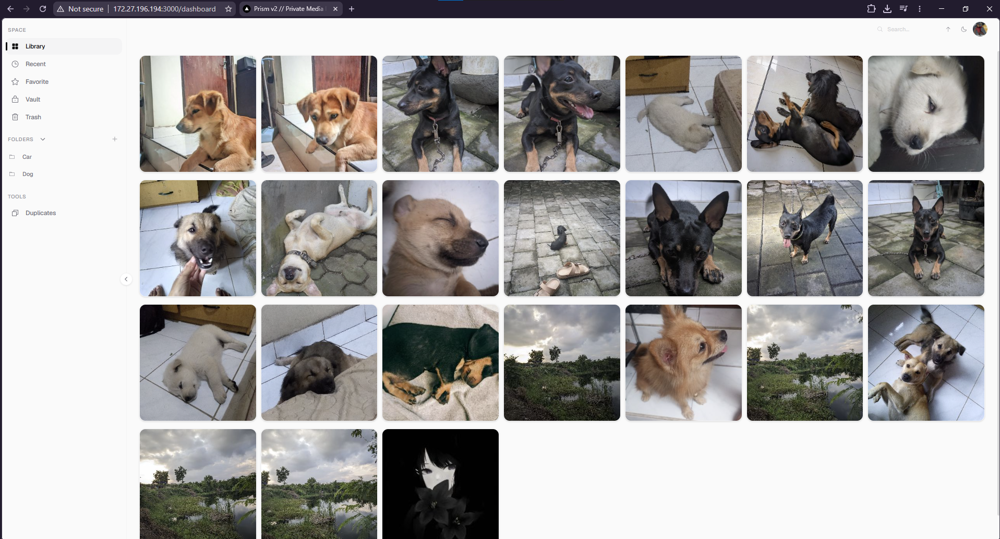

# prism



> **P**lease **R**emember **I**'m **S**till **M**aking this up as i go

local-first photo library. no cloud. no sync. no venture capital. no adult supervision.

```
┌─────────────┐         ┌──────────────────┐         ┌─────────────────┐
│   Browser   │ ──3000──▶    Next.js       │──api/v1─▶     Go          │
└─────────────┘         │  (React 19 +     │         │  (Echo +        │
                        │   App Router)    │         │   pgx + EXIF)   │
                        └────────┬─────────┘         └────────┬────────┘
                                 │                            │
                                 │   goFetch (JSON/multipart) │
                                 │                            │
                                 ▼                            ▼
                    storage/users/{id}/ + PostgreSQL :5432
```

two processes. one database. Next.js is a pure UI layer — every DB query, every file write, every byte of EXIF goes through the Go backend. Node doesn't touch the database, the disk, or your feelings.

---

## features

- **photos on your disk, not someone's training set.** your cat's bad angles remain exclusively yours.
- **PostgreSQL.** one database, all users, `user_id`-scoped queries, foreign keys. we graduated from per-user sqlite like a big kid.
- **folders.** they hold photos. moving a photo into a folder actually removes it from the library now (this was a bug, then it was a fix, then it was a regression test).
- **trash + PIN-protected vault.** the PIN is enforced server-side — un-vaulting without it gets you a 403 and a 15-minute timeout after 5 wrong tries. the lockout counter is shared across every PIN-checking endpoint, because attackers don't care which door they use.
- **image editor** with crop, curves, split toning, filters, undo/redo. Lightroom for people who couldn't afford Lightroom.
- **duplicate detection** via SHA-256. we judge cryptographically, the only honest kind of judgment.
- **video transcoding** via ffmpeg. optional, like pants.
- **EXIF parsing + dominant color palette.** your phone writes weird metadata. we read it anyway, then sanitize it because postgres has standards.
- **storage quotas.** `storage_limit` is actually enforced on upload now. who knew a column could pull its weight.

---

## requirements

| thing | notes |
|-------|-------|
| OS | linux. i tried windows once. it crashed. |
| Node.js | v22+ |
| Go | 1.25+ |
| TypeScript | 5.9 exact. not 7.0. we tried. we have peace now. |
| Docker | for postgres, or a native install if you hate yourself |
| ffmpeg | optional. video features silently skip without it. |

---

## install

**the easy way:**

```bash
git clone https://github.com/ltless/prism.git
cd prism
pnpm install
pnpm setup          # env + postgres + schema + admin user
pnpm dev
```

`pnpm setup` asks for an admin username + password and does the rest. scripting? `echo -e "admin\nmypassword" | pnpm setup`.

**the manual way (if you like pain):**

```bash
pnpm install
pnpm setup:env                          # generate JWT secrets
docker compose up -d                    # postgres
pnpm dev
```

promote yourself to admin:

```bash
docker exec prism-postgres psql -U prism -d prism -c "UPDATE users SET role = 'admin' WHERE username = 'your_username';"
```

registration needs an invite code (`REQUIRE_INVITE=true` by default — it's in `backend/.env` along with `REGISTRATION_INVITE_CODE`). this is so random people can't sign up to your personal photo vault. you're welcome.

both processes must run simultaneously or you get 502s. that's not a bug, it's a *trust exercise*.

---

## commands

```bash
pnpm setup              # one-shot wizard. start here.
pnpm dev                # both processes, hot reload, maximum chaos
pnpm prod               # build + run, less chaos
pnpm test               # vitest. they pass. mostly.
pnpm test:e2e           # playwright, for extra anxiety
cd backend && go test -p 1 ./...   # Go tests. serial. shared test DB. see below.
cd backend && go vet ./...
pnpm lint               # eslint. currently clean. suspicious.
docker compose up -d    # postgres
pnpm setup:env          # regenerate env (idempotent)
pnpm setup:ffmpeg       # install ffmpeg (optional, like oxygen)
```

Go tests run with `-p 1` because all packages share one `prism_test` database and parallel runs cause truncation races. it's not a bug. it's a *concession*. also: postgres must be running on :5432 or every test fails with connection refused and you'll spend ten minutes blaming the wrong thing. i know from experience.

---

## architecture

```
backend/internal/
  api/         Echo handlers per domain:
                 auth/    login, register (invite-gated), logout
                 media/   CRUD, upload (quota-checked), bulk, file serving
                 folders/ CRUD, transactional delete
                 config/  app config (admin-only writes)
                 users/   profile, profile-image upload, storage quota, vault PIN
  auth/        JWT (HMAC-SHA256, issuer "prism"), middleware, RequireAdmin
  vault/       vault-PIN verify + shared failed-attempt lockout (5 tries → 15min)
  config/      env loading (32-byte JWT minimum, enforced)
  db/          GlobalDB + TenantPool, migrations/postgres.sql
  dbtest/      test helpers (embedded schema, truncate between tests)
  media/       Storage (4 path-traversal guard layers), EXIF, video/ffmpeg
  middleware/  CORS (fixed origin), rate limiting (XFF trusted only with TRUST_PROXY=true), quiet logger

src/           Next.js 16 App Router
  app/         /login /register /setup /dashboard /trash /vault /duplicates /editor
  features/    media, onboarding, profile, settings
  lib/         api.ts (goFetch JSON, goFetchUpload multipart), auth context
  auth.ts      cookie → Go /auth/me
```

### the rules (enforced by AGENTS.md, learned the hard way)

1. Node never touches the DB. `goFetch` / `goFetchUpload` only.
2. Node never touches the filesystem either. all file writes go through Go endpoints (`POST /api/v1/users/me/profile-image`, media upload, etc). the one time Next.js wrote profile pics directly to disk, Next and Go had different storage roots and everything 404'd. never again.
3. every tenant query is `WHERE user_id = $1`. no exceptions.
4. file serving goes through the 4 path-traversal guards. `../../etc/passwd` dies at layer 1. absolute paths die at layer 2. symlinks die at layer 3. crafted user IDs die at layer 4.
5. EXIF gets sanitized before insert. postgres JSONB rejects `\u0000` (SQLSTATE 22P05) and doesn't care about your camera's feelings.
6. moving media OUT of the vault requires the PIN, server-side, on every path (bulk, PATCH by id, PATCH by hash). failed attempts share one lockout counter in `internal/vault`.

### auth

Go issues JWTs (HMAC-SHA256, 7-day expiry) as HttpOnly `SameSite=Lax` cookies. login runs a dummy bcrypt compare for unknown usernames so response timing doesn't leak which users exist. the rate limiter keys on the socket peer IP unless `TRUST_PROXY=true` — behind a proxy you control, spoofed `X-Forwarded-For` headers used to rotate the rate limit away. they don't anymore.

---

## security

- **passwords:** bcrypt, cost 10.
- **vault PIN:** bcrypt-hashed, verified server-side on un-vault, 5 failed tries → 15-min lockout shared across all PIN endpoints.
- **invites:** constant-time comparison, required by default.
- **uploads:** extension allowlist + magic-byte validation on every path that writes media files, including the editor.
- **rate limits:** 100/min global, 10/min auth, per-IP. in-memory; resets on restart.
- **library wipe:** admin-only, requires `NUKE_CONFIRMATION_TOKEN` header. unset = endpoint disabled. fail closed.
- **threat model:** unauthenticated attackers, curious non-admin users, and yourself at 3am. not modeled: state adversaries, compromised servers, rogue admins.

don't expose ports 8080 or 5432 to the internet. put a reverse proxy in front of port 3000 and let it do TLS.

---

## deployment

1. reverse proxy (caddy/nginx) → `localhost:3000`, TLS mandatory.
2. postgres in docker or native. change the dev password. i shouldn't have to say this.
3. build: `pnpm build`, `pnpm build:be`. run both processes under systemd.
4. set `NUKE_CONFIRMATION_TOKEN`, `REGISTRATION_INVITE_CODE`, `NEXT_ALLOWED_ORIGINS`, and matching `JWT_SECRET` in both env files.

**caddy:**
```caddyfile
media.yourdomain.com {
  reverse_proxy localhost:3000
}
```

**nginx:** proxy to 3000, `client_max_body_size 210M` (uploads are 200MB + overhead — not optional).

### environment variables

| var | where | notes |
|-----|-------|-------|
| `JWT_SECRET` | `.env.local` + `backend/.env` | must match. 32+ bytes. |
| `DATABASE_URL` | `.env.local` + `backend/.env` | `postgresql://...` |
| `REQUIRE_INVITE` | `backend/.env` | `true` (default). don't lower it unless you trust the internet. |
| `REGISTRATION_INVITE_CODE` | `backend/.env` | the code new users must enter. |
| `NUKE_CONFIRMATION_TOKEN` | `backend/.env` | required for library wipe. `openssl rand -hex 32`. |
| `STORAGE_PATH` | `backend/.env` | default `../storage/users`. keep Next and Go on the same root. |
| `TRUST_PROXY` | `backend/.env` | `true` ONLY behind a proxy you control — enables XFF-based IP extraction for rate limiting. |
| `NEXT_ALLOWED_ORIGINS` | `.env.local` | your domain, for dev-origin allowlisting. |

### backups

```bash
docker exec prism-postgres pg_dump -U prism prism > prism-$(date +%F).sql
rsync -av storage/users/ /backup/users/
```

lose the storage dir or the DB dump and you lose everything. run it via cron. a backup you haven't tested is a prayer, not a backup.

---

## troubleshooting

**502s** — one process died. `pnpm dev` runs both; check which one is missing.

**postgres connection refused** — `docker compose up -d`. or a native postgres you forgot about is squatting on :5432. `lsof -i :5432`.

**profile/cover image 404** — Next and Go are pointing at different `STORAGE_PATH` roots. one process was started with a different env than the other. restart both from the same place. (this exact bug is why rule #2 exists.)

**upload 500 / "unsupported unicode escape"** — EXIF control chars beating the sanitizer. file an issue, include the photo, and i apologize in advance.

**"cannot reach server" on login** — the backend is down, OR your credentials are wrong and the old error handling swallowed the real message. current builds surface the actual error. update.

**photos shuffle randomly on refresh** — fixed (stable `ORDER BY created_at DESC, id DESC`). if it's back, someone touched the ORDER BY. revert them.

---

<div align="center">

*one database. one query layer. two processes. zero guarantees.*

**proprietary. all rights reserved. therapy: not included.**

</div>
